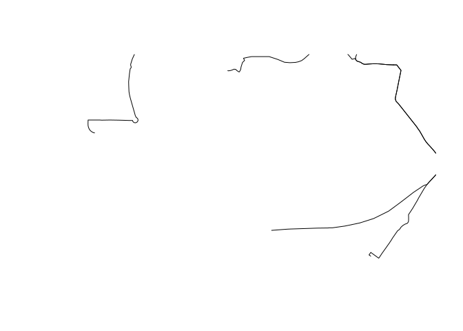
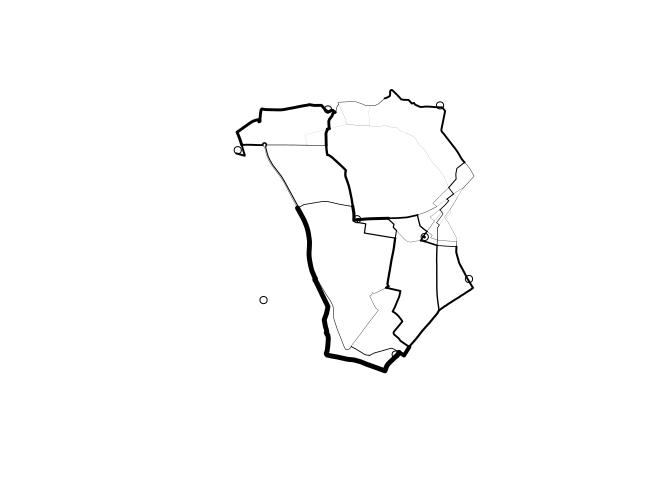
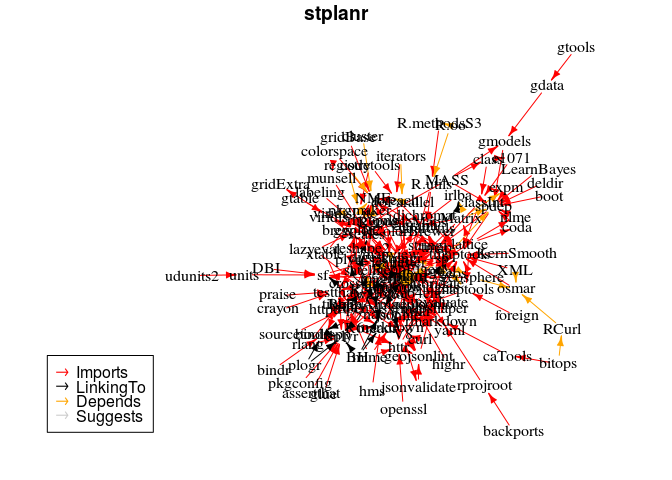

<!-- README.md is generated from README.Rmd. Please edit that file -->
[](https://travis-ci.org/ropensci/stplanr) [](https://cran.r-project.org/package=stplanr) [](https://github.com/metacran/cranlogs.app) [](https://codecov.io/github/ropensci/stplanr?branch=master)

**stplanr** is a package for sustainable transport planning with R.

It provides functions for solving common problems in transport planning and modelling, such as how to best get from point A to point B. The overall aim is to provide a reproducible, transparent and accessible toolkit to help people better understand transport systems and inform policy.

The initial work on the project was funded by the Department of Transport ([DfT](https://www.gov.uk/government/organisations/department-for-transport)) as part of the development of the Propensity to Cycle Tool ([PCT](http://pct.bike/)). The PCT uses origin-destination data as the basis of spatial analysis and modelling work to identify where bicycle paths are most needed. See the package vignette (e.g. via `vignette("introducing-stplanr")`) or an [academic paper on the Propensity to Cycle Tool (PCT)](http://dx.doi.org/10.5198/jtlu.2016.862) for more information on how it can be used. This README gives some basics.

**stplanr** should be useful to researchers everywhere. The function `route_graphhopper()`, for example, works anywhere in the world using the [graphhopper](https://graphhopper.com/) routing API and `read_table_builder()` reads-in Australian data. We welcome contributions that make transport research easier worldwide.

Key functions
-------------

Data frames representing flows between origins and destinations must be combined with geo-referenced zones or points to generate meaningful analyses and visualisations of 'flows' or origin-destination (OD) data. **stplanr** facilitates this with `od2line()`, which takes flow and geographical data as inputs and outputs a `SpatialLinesDataFrame`. Some example data is provided in the package:

``` r
library(stplanr)
data(cents, flow)
```

Let's take a look at this data:

``` r
flow[1:3, 1:3] # typical form of flow data
#>        Area.of.residence Area.of.workplace All
#> 920573         E02002361         E02002361 109
#> 920575         E02002361         E02002363  38
#> 920578         E02002361         E02002367  10
cents[1:3,] # points representing origins and destinations
#> class       : SpatialPointsDataFrame 
#> features    : 3 
#> extent      : -1.546463, -1.511861, 53.8041, 53.81161  (xmin, xmax, ymin, ymax)
#> coord. ref. : +init=epsg:4326 +proj=longlat +datum=WGS84 +no_defs +ellps=WGS84 +towgs84=0,0,0 
#> variables   : 4
#> names       :  geo_code,  MSOA11NM, percent_fem,  avslope 
#> min values  : E02002382, Leeds 053,    0.408759, 2.284782 
#> max values  : E02002393, Leeds 064,    0.458721, 2.856563
```

These datasets can be combined as follows:

``` r
travel_network <- od2line(flow = flow, zones = cents)
w <- flow$All / max(flow$All) *10
plot(travel_network, lwd = w)
```


The package can also allocate flows to the road network, for example through a link to the [CycleStreets.net API](https://www.cyclestreets.net/api/).

Route functions take lat/lon inputs:

``` r
trip <-
  route_cyclestreet(from = c(-1, 53), to = c(-1.1, 53), plan = "balanced")
```

and place names, found using the Google Map API:

``` r
if(!Sys.getenv("CYCLESTREET") == ""){
  trip <- route_cyclestreet("Bradford, UK", "Leeds, UK", plan = "balanced")
  plot(trip)
}
```


We can replicate this call to CycleStreets.net multiple times using `line2route`.

``` r
intrazone <- travel_network$Area.of.residence == travel_network$Area.of.workplace
travel_network <- travel_network[!intrazone,]
if(Sys.getenv("CYCLESTREET") == ""){
  t_routes = routes_fast
} else {
  t_routes <- line2route(travel_network)
}
plot(t_routes)
```



Another way to visualise this is with the leaflet package:

``` r
library(leaflet)
leaflet() %>% addTiles() %>% addPolylines(data = t_routes)
```

For more examples, `example("line2route")`.

`overline` is a function which takes a series of route-allocated lines, splits them into unique segments and aggregates the values of overlapping lines. This can represent where there will be most traffic on the transport system, as illustrated below.

``` r
t_routes$All <- travel_network$All
rnet <- overline(sldf = t_routes, attrib = "All", fun = sum)

lwd <- rnet$All / mean(rnet$All)
plot(rnet, lwd = lwd)
points(cents)
```



Installation
------------

To install the stable version, use:

``` r
install.packages("stplanr")
```

The development version can be installed using **devtools**:

``` r
# install.packages("devtools") # if not already installed
devtools::install_github("ropensci/stplanr")
library(stplanr)
```

stplanr depends on rgdal, which can be tricky to install.

### Installing rgdal on Ubuntu and Mac

On Ubuntu rgdal can be installed with:

    sudo apt-get install r-cran-rgdal

Using apt-get ensures the system dependencies, such as [gdal](http://trac.osgeo.org/gdal/wiki/DownloadingGdalBinaries) are also installed.

On Mac, homebrew can install gdal. Full instructions are provided [here](https://github.com/ropensci/geojsonio#install).

Funtions, help and contributing
-------------------------------

The current list of available functions can be seen with:

``` r
lsf.str("package:stplanr", all = TRUE)
```

To get internal help on a specific function, use the standard way.

``` r
?od2line
```

Dependencies
------------

**stplanr** has many dependencies. These are designed to help make it fast, but may make it slow to install for the first time.

Its dependencies are plotted below using the **minCRAN** package:

``` r
dg <- miniCRAN::makeDepGraph("stplanr")
plot(dg)
```



Meta
----

-   Please report issues, feature requests and questions to the [github issue tracker](https://github.com/ropensci/stplanr/issues)
-   License: MIT
-   Get citation information for `stplanr` in R doing `citation(package = 'stplanr')`
-   This project is released with a [Contributor Code of Conduct](CONDUCT.md). By participating in this project you agree to abide by its terms.

<!-- [](http://ropensci.org) -->
