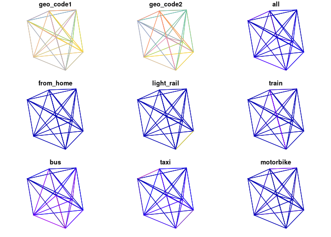
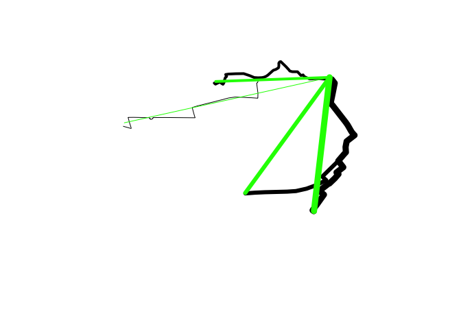
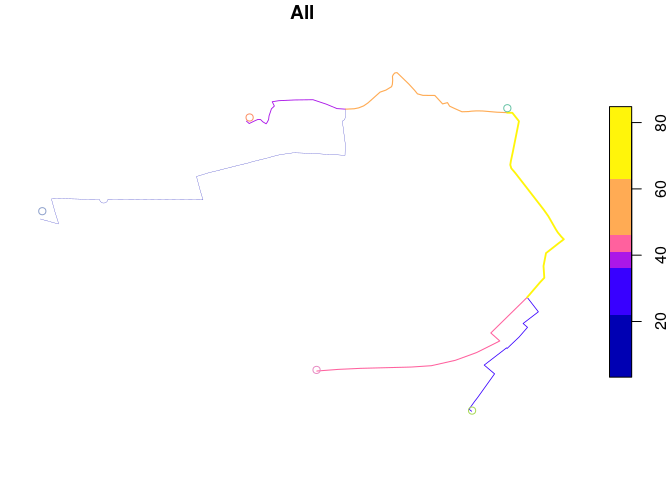

<!-- README.md is generated from README.Rmd. Please edit that file -->
[](https://travis-ci.org/ropensci/stplanr) [](https://github.com/metacran/cranlogs.app) [](https://cran.r-project.org/package=stplanr) [](https://cran.r-project.org/package=stplanr) [](https://www.tidyverse.org/lifecycle/#maturing) [](https://github.com/ropensci/onboarding/issues/10)

**stplanr** is a package for sustainable transport planning with R.

It provides functions for solving common problems in transport planning and modelling, such as how to best get from point A to point B. The overall aim is to provide a reproducible, transparent and accessible toolkit to help people better understand transport systems and inform policy, as outlined in a [paper](https://journal.r-project.org/archive/2018/RJ-2018-053/index.html) about the package, and the potential for open source software in transport planning in general, published in the [R Journal](https://journal.r-project.org/).

The initial work on the project was funded by the Department of Transport ([DfT](https://www.gov.uk/government/organisations/department-for-transport)) as part of the development of the Propensity to Cycle Tool (PCT), a web application to explore current travel patterns and cycling potential at zone, desire line, route and route network levels (see [www.pct.bike](http://www.pct.bike/) and click on a region to try it out). The basis of the methods underlying the PCT is origin-destination data, which are used to highlight where many short distance trips are being made, and estimate how many could switch to cycling. The results help identify where cycleways are most needed, an important component of sustainable transport planning infrastructure engineering and policy [design](https://www.icevirtuallibrary.com/doi/abs/10.1680/dfct.63495.001). See the package vignette (e.g. via `vignette("introducing-stplanr")`) or an [academic paper on the Propensity to Cycle Tool (PCT)](http://dx.doi.org/10.5198/jtlu.2016.862) for more information on how it can be used. This README provides some basics.

**stplanr** should be useful to researchers everywhere. The function `route_graphhopper()`, for example, works anywhere in the world using the [graphhopper](https://graphhopper.com/) routing API and `read_table_builder()` reads-in Australian data. We welcome contributions that make transport research easier worldwide.

Key functions
-------------

Data frames representing flows between origins and destinations must be combined with geo-referenced zones or points to generate meaningful analyses and visualisations of 'flows' or origin-destination (OD) data. **stplanr** facilitates this with `od2line()`, which takes flow and geographical data as inputs and outputs spatial data. Some example data is provided in the package:

``` r
library(stplanr)
```

Let's take a look at this data:

``` r
flow[1:3, 1:3] # typical form of flow data
#>        Area.of.residence Area.of.workplace All
#> 920573         E02002361         E02002361 109
#> 920575         E02002361         E02002363  38
#> 920578         E02002361         E02002367  10
cents_sf[1:3,] # points representing origins and destinations
#> Simple feature collection with 3 features and 4 fields
#> geometry type:  POINT
#> dimension:      XY
#> bbox:           xmin: -1.546463 ymin: 53.8041 xmax: -1.511861 ymax: 53.81161
#> epsg (SRID):    4326
#> proj4string:    +proj=longlat +datum=WGS84 +no_defs
#>       geo_code  MSOA11NM percent_fem  avslope                   geometry
#> 1708 E02002384 Leeds 055    0.458721 2.856563 POINT (-1.546463 53.80952)
#> 1712 E02002382 Leeds 053    0.438144 2.284782 POINT (-1.511861 53.81161)
#> 1805 E02002393 Leeds 064    0.408759 2.361707  POINT (-1.524205 53.8041)
```

These datasets can be combined as follows:

``` r
travel_network <- od2line(flow = flow, zones = cents_sf)
w <- flow$All / max(flow$All) *10
plot(travel_network, lwd = w)
```



The package can also allocate flows to the road network, e.g. with [CycleStreets.net](https://www.cyclestreets.net/api/) and the OpenStreetMap Routing Machine ([OSRM](https://github.com/Project-OSRM/osrm-backend)) API interfaces. These are supported in `route_*()` functions such as `route_cyclestreets` and `route_osrm()`:

Route functions take lat/lon inputs (results not calculated):

``` r
trip <- route_osrm(from = c(-1, 53), to = c(-1.1, 53))
```

and place names, found using the Google Map API:

We can replicate this call multiple times using `line2route`, in this case lines 2 to 5. First we'll create a small subset of the lines:

``` r
desire_lines <- travel_network[2:5,]
```

Next, we'll calculate the routes (not not evaluated):

``` r
routes <- line2route(desire_lines, route_fun = route_osrm)
```

The resulting routes will look something like this:

``` r
routes = routes_fast_sf[2:5, ]
plot(routes$geometry)
```



Another way to visualise this is with the leaflet package:

``` r
library(leaflet)
leaflet() %>% addTiles() %>% addPolylines(data = routes)
#> PhantomJS not found. You can install it with webshot::install_phantomjs(). If it is installed, please make sure the phantomjs executable can be found via the PATH variable.
```

<!--html_preserve-->

<script type="application/json" data-for="htmlwidget-276d65ff5a2198e29d8a">{"x":{"options":{"crs":{"crsClass":"L.CRS.EPSG3857","code":null,"proj4def":null,"projectedBounds":null,"options":{}}},"calls":[{"method":"addTiles","args":["//{s}.tile.openstreetmap.org/{z}/{x}/{y}.png",null,null,{"minZoom":0,"maxZoom":18,"tileSize":256,"subdomains":"abc","errorTileUrl":"","tms":false,"noWrap":false,"zoomOffset":0,"zoomReverse":false,"opacity":1,"zIndex":1,"detectRetina":false,"attribution":"&copy; <a href=\"http://openstreetmap.org\">OpenStreetMap<\/a> contributors, <a href=\"http://creativecommons.org/licenses/by-sa/2.0/\">CC-BY-SA<\/a>"}]},{"method":"addPolylines","args":[[[[{"lng":[-1.516748,-1.517513,-1.518565,-1.518995,-1.519367,-1.51956,-1.519929,-1.520062,-1.520607,-1.520964,-1.521119,-1.521478,-1.522046,-1.522921,-1.523319,-1.52353,-1.523958,-1.524818,-1.524979,-1.525086,-1.525151,-1.525135,-1.52516,-1.525218,-1.525322,-1.525431,-1.525633,-1.526059,-1.526957,-1.527264,-1.527627,-1.527957,-1.528289,-1.528587,-1.529218,-1.529992,-1.530974,-1.532304,-1.533471,-1.533959,-1.533804,-1.534019,-1.534106,-1.534193,-1.534227,-1.534321,-1.534408,-1.534651,-1.534814,-1.535008,-1.535186,-1.535647,-1.535849],"lat":[53.828682,53.828702,53.828755,53.828759,53.828746,53.82873,53.828723,53.828721,53.828864,53.828963,53.829115,53.829061,53.829425,53.82943,53.829495,53.829649,53.829923,53.830414,53.830398,53.830331,53.830255,53.83008,53.829901,53.829804,53.829768,53.829729,53.829657,53.82957,53.829098,53.828974,53.828889,53.82885,53.828841,53.828833,53.828858,53.829048,53.829242,53.829231,53.8292,53.829154,53.828968,53.828847,53.828692,53.828542,53.828382,53.828272,53.8282,53.828287,53.828383,53.828388,53.828344,53.828212,53.828316]}]],[[{"lng":[-1.516748,-1.517513,-1.518565,-1.518995,-1.519367,-1.51956,-1.519929,-1.520062,-1.520607,-1.520964,-1.521119,-1.521478,-1.522046,-1.522921,-1.523319,-1.52353,-1.523958,-1.524818,-1.524979,-1.525086,-1.525151,-1.525135,-1.52516,-1.525218,-1.525322,-1.525431,-1.525633,-1.526059,-1.526957,-1.527264,-1.527627,-1.527957,-1.528289,-1.528587,-1.528568,-1.528664,-1.528824,-1.528609,-1.528627,-1.529172,-1.529736,-1.530097,-1.530997,-1.531948,-1.532425,-1.533407,-1.533934,-1.534453,-1.534878,-1.535397,-1.535563,-1.535722,-1.536532,-1.537289,-1.537704,-1.537756,-1.538161,-1.538208,-1.538534,-1.538646,-1.539025,-1.539511,-1.539238,-1.539033,-1.539206,-1.540216,-1.540885,-1.540919,-1.543086,-1.544014,-1.545611,-1.545993,-1.546004,-1.546021,-1.546056,-1.546091,-1.546156,-1.546226,-1.546298,-1.54636,-1.546394,-1.546441,-1.546475,-1.546504,-1.546533,-1.546549,-1.546591,-1.546613,-1.547084,-1.547559,-1.548204,-1.549209,-1.550139,-1.549882,-1.549642,-1.549629,-1.550964],"lat":[53.828682,53.828702,53.828755,53.828759,53.828746,53.82873,53.828723,53.828721,53.828864,53.828963,53.829115,53.829061,53.829425,53.82943,53.829495,53.829649,53.829923,53.830414,53.830398,53.830331,53.830255,53.83008,53.829901,53.829804,53.829768,53.829729,53.829657,53.82957,53.829098,53.828974,53.828889,53.82885,53.828841,53.828833,53.828532,53.828377,53.828315,53.827332,53.826834,53.826857,53.826881,53.826885,53.826918,53.826939,53.826945,53.826863,53.826786,53.826699,53.82664,53.826564,53.826534,53.826505,53.826392,53.826278,53.826216,53.826208,53.826147,53.82614,53.826096,53.826078,53.826007,53.825922,53.825319,53.824912,53.824918,53.824923,53.824926,53.824926,53.824938,53.824943,53.824937,53.824936,53.824904,53.824879,53.824845,53.824822,53.824795,53.824779,53.824773,53.824776,53.824778,53.824789,53.824803,53.824816,53.824833,53.824843,53.824884,53.824929,53.82493,53.824932,53.824946,53.824959,53.824952,53.824396,53.823946,53.823867,53.824085]}]],[[{"lng":[-1.516748,-1.516669,-1.516368,-1.515884,-1.516341,-1.516471,-1.51652,-1.516442,-1.516152,-1.514084,-1.514019,-1.51373,-1.513189,-1.513033,-1.512779,-1.512596,-1.512986,-1.5139,-1.514083,-1.514027,-1.514333,-1.515281,-1.517213,-1.517944,-1.517289,-1.518983,-1.520543,-1.522303,-1.523751,-1.524222,-1.525439,-1.527485,-1.528518,-1.52886,-1.529115,-1.53065,-1.530693],"lat":[53.828682,53.82868,53.828675,53.828313,53.826961,53.826603,53.826422,53.826273,53.826072,53.824497,53.824444,53.824202,53.823643,53.823498,53.823317,53.823206,53.82303,53.822608,53.822051,53.82154,53.821348,53.820695,53.819577,53.819154,53.818808,53.818308,53.817972,53.817738,53.817681,53.817673,53.817655,53.817624,53.817595,53.817586,53.817579,53.81751,53.817505]}]],[[{"lng":[-1.516748,-1.516669,-1.516368,-1.515884,-1.516341,-1.516471,-1.51652,-1.516442,-1.516152,-1.514084,-1.514019,-1.51373,-1.513189,-1.513033,-1.512779,-1.512596,-1.512986,-1.5139,-1.514083,-1.514027,-1.514333,-1.515281,-1.514462,-1.515579,-1.515257,-1.515874,-1.516437,-1.516751,-1.516792,-1.51843,-1.517671,-1.517889,-1.518103,-1.518292,-1.518505,-1.51873,-1.518937,-1.519148,-1.519342,-1.519539,-1.519349],"lat":[53.828682,53.82868,53.828675,53.828313,53.826961,53.826603,53.826422,53.826273,53.826072,53.824497,53.824444,53.824202,53.823643,53.823498,53.823317,53.823206,53.82303,53.822608,53.822051,53.82154,53.821348,53.820695,53.820069,53.819564,53.819398,53.818978,53.818662,53.818484,53.81851,53.817765,53.817386,53.817206,53.81703,53.816873,53.816698,53.816511,53.816341,53.816182,53.81602,53.815854,53.815769]}]]],null,null,{"interactive":true,"className":"","stroke":true,"color":"#03F","weight":5,"opacity":0.5,"fill":false,"fillColor":"#03F","fillOpacity":0.2,"smoothFactor":1,"noClip":false},null,null,null,{"interactive":false,"permanent":false,"direction":"auto","opacity":1,"offset":[0,0],"textsize":"10px","textOnly":false,"className":"","sticky":true},null]}],"limits":{"lat":[53.815769,53.830414],"lng":[-1.550964,-1.512596]}},"evals":[],"jsHooks":[]}</script>
<!--/html_preserve-->
For more examples, `example("line2route")`.

`overline` is a function which takes a series of route-allocated lines, splits them into unique segments and aggregates the values of overlapping lines. This can represent where there will be most traffic on the transport system, as illustrated below.

``` r
routes$All <- desire_lines$All
rnet <- overline2(routes, attrib = "All")
#> 2019-05-10 09:11:51 constructing segments
#> 2019-05-10 09:11:51 building geometry
#> 2019-05-10 09:11:51 simplifying geometry
#> 2019-05-10 09:11:51 aggregating flows
#> 2019-05-10 09:11:51 rejoining segments into linestrings

lwd <- rnet$All / mean(rnet$All)
plot(rnet, lwd = lwd, reset = FALSE)
plot(cents_sf, add = TRUE)
```



Installation
------------

To install the stable version, use:

``` r
install.packages("stplanr")
```

The development version can be installed using **devtools**:

``` r
# install.packages("devtools") # if not already installed
devtools::install_github("ropensci/stplanr")
library(stplanr)
```

stplanr depends on rgdal, which can be tricky to install.

### Installing stplanr on Linux and Mac

**splanr** depends on **rgdal** which can be installed on Ubuntu, for example, with:

    sudo apt install r-cran-rgdal

To install `gdal` binaries on other distributions please see here: <http://trac.osgeo.org/gdal/wiki/DownloadingGdalBinaries>

**stplanr** also depends on **sf**. Installation instructions for Mac, Ubuntu and other Linux distros can be found here: <https://github.com/r-spatial/sf#installing>

Instructions to install `gdal` and `Quartz` are provided at <https://github.com/ropensci/geojsonio#install> and <https://www.xquartz.org/> respectively (Quartz is required for R - as described [here](https://cran.r-project.org/bin/macosx/)).

Funtions, help and contributing
-------------------------------

The current list of available functions can be seen on the package's website at [ropensci.github.io/stplanr/](https://ropensci.github.io/stplanr/), or with the following command:

``` r
lsf.str("package:stplanr", all = TRUE)
```

To get internal help on a specific function, use the standard way.

``` r
?od2line
```

To contribute, report bugs or request features, see the [issue tracker](https://github.com/ropensci/stplanr/issues).

Further resources / tutorials
-----------------------------

Want to learn how to use open source software for reproducible sustainable transport planning work? Now is a great time to learn. Transport planning is a relatively new field of application in R. However, there are already some good resources on the topic, including (any further suggestions: welcome):

-   The Transport chapter of *Geocomputation with R*, which provides a broad introduction from a geographic data perspective: <https://geocompr.robinlovelace.net/transport.html>
-   The `stplanr` paper, which describes the context in which the package was developed: <https://journal.r-project.org/archive/2018/RJ-2018-053/index.html>
-   The `dodgr` vignette, which provides an introduction to routing in R: <https://cran.r-project.org/package=dodgr/vignettes/dodgr.html>

Meta
----

-   Please report issues, feature requests and questions to the [github issue tracker](https://github.com/ropensci/stplanr/issues)
-   License: MIT
-   Get citation information for `stplanr` in R doing `citation(package = 'stplanr')`
-   This project is released with a [Contributor Code of Conduct](CONDUCT.md). By participating in this project you agree to abide by its terms.

[](http://ropensci.org)
