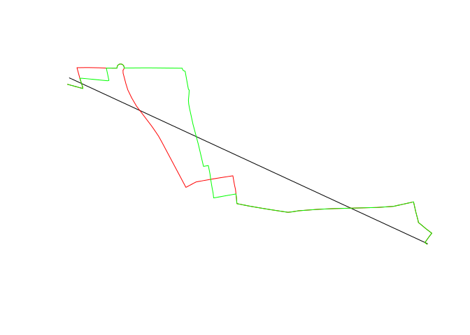
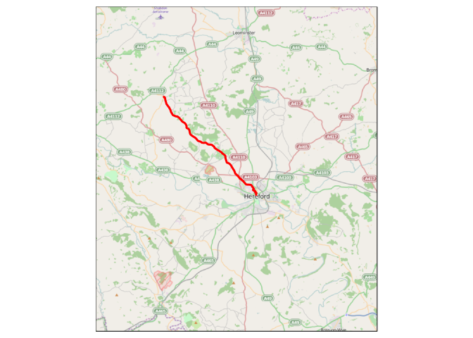

# stplanr

[](https://travis-ci.org/Robinlovelace/stplanr) [](http://cran.r-project.org/web/packages/stplanr)


```
## Loading required package: sp
```


This is a package for sustainable transport planning in R (stplanr).

It brings together a range of tools for transport planning practitioners and
researchers to better understand transport systems and inform policy.

The initial work on the project was funded by the Department of Transport
([DfT](https://www.gov.uk/government/organisations/department-for-transport))
as part of the National Propensity to Cycle Tool
([NPCT](http://www.cedar.iph.cam.ac.uk/research/modelling/npct-tool/)) project to
identify where bicycle paths are most urgently needed.

## Key functions

Square data frames representing flows between origins and destinations
must be combined with geo-referenced zones or points to generate meaningful
analyses and visualisations of flows. **stplanr** facilitates this with 
`od2line()`, which takes flow and geographical data as inputs and
outputs a `SpatialLinesDataFrame`. Some example data is provided in the package:


```r
library(stplanr)
data(cents, flow)
```

Let's take a look at this data:


```r
flow[1:3, 1:3] # typical form of flow data
```

```
##        Area.of.residence Area.of.workplace All
## 920573         E02002361         E02002361 109
## 920575         E02002361         E02002363  38
## 920578         E02002361         E02002367  10
```

```r
cents[1:3,] # points representing origins and destinations
```

```
##                coordinates  geo_code  MSOA11NM percent_fem  avslope
## 1708 (-1.546463, 53.80952) E02002384 Leeds 055    0.458721 2.856563
## 1712 (-1.511861, 53.81161) E02002382 Leeds 053    0.438144 2.284782
## 1805  (-1.524205, 53.8041) E02002393 Leeds 064    0.408759 2.361707
```

These datasets can be combined as follows:


```r
travel_network <- od2line(flow = flow, zones = cents)
w <- flow$All / max(flow$All) *10
plot(travel_network, lwd = w)
```

 

The package can also allocate flows to the travel network, for example through
a link to the [CycleStreets.net API](https://www.cyclestreets.net/api/):


```r
example("line2route")
```

  

## Installation


```r
# you must have the devtools package (e.g. via install.packages("devtools"))
devtools::install_github("robinlovelace/stplanr")
library(stplanr)
```

## Getting help

We aim to make this package well-documented to make it easy to use.
R's internal help functions will help here:


```r
?route_cyclestreet # get help on an stplanr function
if(Sys.info()["sysname"] == "Linux"){
  # On Linux
  mytoken <- readLines("~/Dropbox/dotfiles/cyclestreets-api-key-rl")
} else {
  # Example on Windows
  mytoken <- readLines("file:///C:/Users/georl/Dropbox/dotfiles/cyclestreets-api-key-rl")
}
Sys.setenv(CYCLESTREET = mytoken)
trip_to_pub <- route_cyclestreet(from = "Weobley", to = "Hereford", plan = "balanced")
# devtools::install_github("mtennekes/tmap", subdir = "pkg")
library(tmap)
osm_tiles <- read_osm(bb("Herefordshire", ext = 0.6, projection ="longlat"))
tm_shape(osm_tiles) +
  tm_raster() +
  tm_shape(trip_to_pub) +
  tm_lines(lwd = 3)
```

```
## Warning in (function (x, shp_nm) : Currect projection of shape trip_to_pub
## unknown. Long-lat (WGS84) is assumed.
```

 

The current list of available functions from stplanr is printed by the following
command:


```r
lsf.str("package:stplanr", all = TRUE)
```

```
## age_recat : function (a)  
## age_recat2 : function (a)  
## bbox_scale : function (bb, scale_factor)  
## dd_logcub : function (x, a, b1, b2, b3)  
## dd_loglin : function (x, a = 0.3, b1 = -0.2)  
## dd_logsqrt : function (x, a, b1, b2)  
## disab_recat : function (a)  
## gClip : function (shp, bb)  
## gMapshape : function (dsn, percent)  
## gOnewaygeo : function (x, attrib)  
## gOnewayid : function (x, attrib, id1 = names(x)[1], id2 = names(x)[2])  
## gOverline : function (sldf, attrib, fun = sum, na.zero = FALSE)  
## gSection : function (sl)  
## islines : function (g1, g2)  
## line2df : function (l)  
## line2route : function (ldf, ...)  
## lineLabels : function (sldf, attrib)  
## od2line : function (flow, zones)  
## readTableBuilder : function (dataset, filetype = "csv", sheet = 1, removeTotal = TRUE)  
## route_cyclestreet : function (from, to, plan = "fastest", silent = FALSE)  
## route_graphhopper : function (from, to, vehicle = "bike")
```


Any questions?

Email me on rob00 x at gmail dot com!


