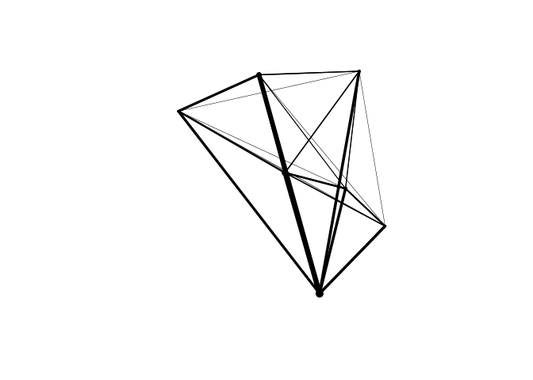
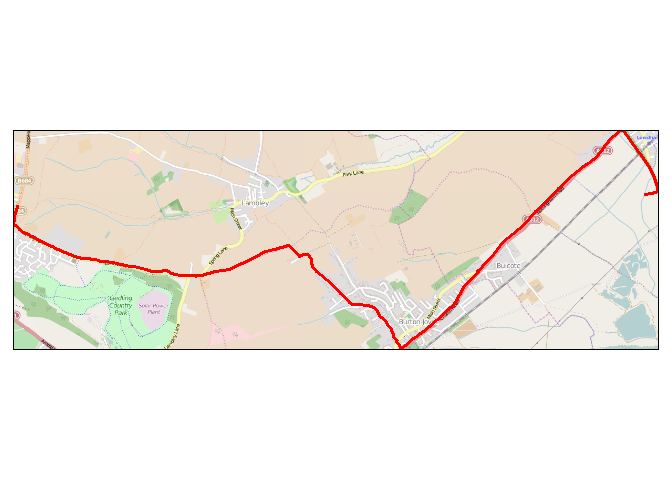
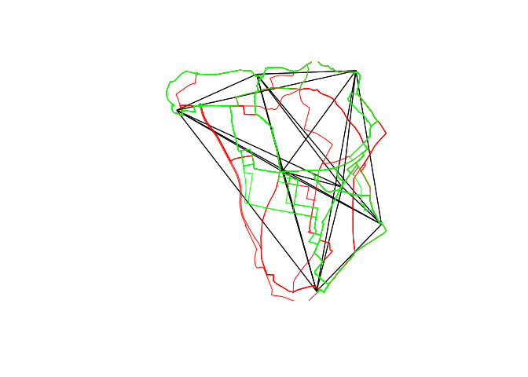
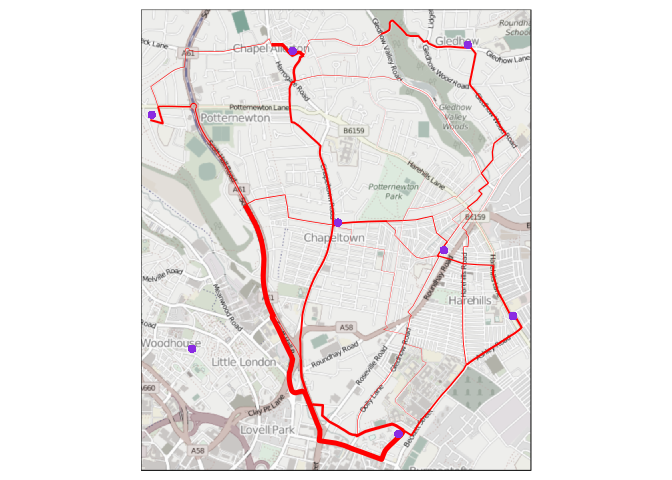

# stplanr

[](https://travis-ci.org/ropensci/stplanr) [](http://cran.r-project.org/web/packages/stplanr)


This is a package for sustainable transport planning with R (stplanr).

It brings together a range of tools for transport planning practitioners and
researchers to better understand transport systems and inform policy.

The initial work on the project was funded by the Department of Transport
([DfT](https://www.gov.uk/government/organisations/department-for-transport))
as part of the National Propensity to Cycle Tool
([NPCT](http://www.ecf.com/news/national-propensity-to-cycle-tool-project-summary-report/)) project to
identify where bicycle paths are most urgently needed
([Lovelace et al., 2015](http://arxiv.org/abs/1509.04425)).

Although it was started in the UK it aims to be of use to researchers everywhere.
The function `route_graphhopper()`, for example, works anywhere in the world
using the [graphhopper](https://graphhopper.com/) routing API and
`read_table_builder()` reads-in Australian data. We welcome contributions that make
transport research easier in any nation.

## Key functions

Data frames representing flows between origins and destinations
must be combined with geo-referenced zones or points to generate meaningful
analyses and visualisations of 'flows' or origin-destination (OD) data
([Caceres 2007](https://www.researchgate.net/profile/Francisco_Benitez/publication/3480996_Deriving_origin_destination_data_from_a_mobile_phone_network/links/0f31753ad7db9e7ece000000.pdf)).
**stplanr** facilitates this with
`od2line()`, which takes flow and geographical data as inputs and
outputs a `SpatialLinesDataFrame`. Some example data is provided in the package:


```r
library(stplanr)
data(cents, flow)
```

Let's take a look at this data:


```r
flow[1:3, 1:3] # typical form of flow data
```

```
##        Area.of.residence Area.of.workplace All
## 920573         E02002361         E02002361 109
## 920575         E02002361         E02002363  38
## 920578         E02002361         E02002367  10
```

```r
cents[1:3,] # points representing origins and destinations
```

```
## class       : SpatialPointsDataFrame 
## features    : 3 
## extent      : -1.546463, -1.511861, 53.8041, 53.81161  (xmin, xmax, ymin, ymax)
## coord. ref. : +init=epsg:4326 +proj=longlat +datum=WGS84 +no_defs +ellps=WGS84 +towgs84=0,0,0 
## variables   : 4
## names       :  geo_code,  MSOA11NM, percent_fem,  avslope 
## min values  : E02002382, Leeds 053,    0.408759, 2.284782 
## max values  : E02002393, Leeds 064,    0.458721, 2.856563
```

These datasets can be combined as follows:


```r
travel_network <- od2line(flow = flow, zones = cents)
w <- flow$All / max(flow$All) *10
plot(travel_network, lwd = w)
```

 

The package can also allocate flows to the road network, for example through
a link to the [CycleStreets.net API](https://www.cyclestreets.net/api/):


```r
# Route functions take lat/lon inputs...
# trip <- route_cyclestreet(from = c(-1, 53), to = c(-1.1, 53), plan = "balanced")

# ...and place names, found using the Google Map API:
trip <- route_cyclestreet("London", "Birmingham, UK", plan = "balanced")
# devtools::install_github("mtennekes/tmap", subdir = "pkg")
library(tmap)
osm_tiles <- read_osm(bb(bbox(trip), ext = 1.5))
tm_shape(osm_tiles) +
  tm_raster() +
  tm_shape(trip) +
  tm_lines(lwd = 3)
```

 

We can replicate this call to CycleStreets.net multiple times
using `line2route`.


```r
# Remove intra-zone flow
intrazone <- travel_network$Area.of.residence == travel_network$Area.of.workplace
travel_network <- travel_network[!intrazone,]
routes <- line2route(travel_network)
plot(routes)
```

 

For more examples, `example("line2route")`.

`overline` is a function which takes a series of route-allocated lines,
splits them into unique segmentes and aggregates
the values of overlapping lines. This can represent where there will be
most traffic on the transport system, as illustrated
below using the [tmap](https://github.com/mtennekes/tmap) package.


```r
routes$All <- travel_network$All
rnet <- overline(sldf = routes, attrib = "All", fun = sum)

osm_tiles <- read_osm(bb(rnet, ext = 1.05))
rnet$lwd <- rnet$All / mean(rnet$All)
tm_shape(osm_tiles) +
    tm_raster(saturation = .25) +
tm_shape(rnet) +
    tm_lines(lwd = "lwd", scale = 5, legend.lwd.show = FALSE)  +
tm_shape(cents) +
    tm_bubbles()
```

 

## Installation


```r
# you must have the devtools package (e.g. via install.packages("devtools"))
devtools::install_github("ropensci/stplanr")
library(stplanr)
```

stplanr depends on rgdal, which can be difficult to installon Mac and Linux
users.

### Installing rgdal on Ubuntu and Mac

On Ubuntu rgdal can be installed with:

```
sudo apt-get install r-cran-rgdal
```

Using apt-get ensures the system dependencies, such as
[gdal](http://trac.osgeo.org/gdal/wiki/DownloadingGdalBinaries) are also installed.

On Mac, homebrew can install gdal. Full instructions are provided
[here](https://github.com/ropensci/geojsonio#install).


## Funtions, help and contributing

The current list of available functions can be seen with:


```r
lsf.str("package:stplanr", all = TRUE)
```

```
## age_recat : function (a)  
## age_recat2 : function (a)  
## bbox_scale : function (bb, scale_factor)  
## calc_catchment : function (polygonlayer, targetlayer, calccols, distance = 500, projection = paste0("+proj=aea +lat_1=90 +lat_2=-18.416667 ", 
##     "+lat_0=0 +lon_0=10 +x_0=0 +y_0=0 +ellps=GRS80", " +towgs84=0,0,0,0,0,0,0 +units=m +no_defs"), 
##     retainAreaProportion = FALSE, dissolve = FALSE)  
## calc_catchment_sum : function (polygonlayer, targetlayer, calccols, distance = 500, projection = paste0("+proj=aea +lat_1=90 +lat_2=-18.416667", 
##     " +lat_0=0 +lon_0=10 +x_0=0 +y_0=0", " +ellps=GRS80 +towgs84=0,0,0,0,0,0,0 +units=m +no_defs"), 
##     retainAreaProportion = FALSE)  
## calc_moving_catchment : function (polygonlayer, targetlayer, calccols, distance = 500, projection = "worldalbers", 
##     retainAreaProportion = FALSE)  
## cyclestreet_pat : function (force = FALSE)  
## dd_logcub : function (x, a, b1, b2, b3)  
## dd_loglin : function (x, a = 0.3, b1 = -0.2)  
## dd_logsqrt : function (x, a, b1, b2)  
## disab_recat : function (a)  
## gclip : function (shp, bb)  
## graphhopper_pat : function (force = FALSE)  
## gsection : function (sl)  
## islines : function (g1, g2)  
## line2df : function (l)  
## line2route : function (ldf, ...)  
## lineLabels : function (sldf, attrib)  
## mapshape : function (dsn, percent)  
## od2line : function (flow, zones)  
## onewaygeo : function (x, attrib)  
## onewayid : function (x, attrib, id1 = names(x)[1], id2 = names(x)[2])  
## overline : function (sldf, attrib, fun = sum, na.zero = FALSE)  
## read_table_builder : function (dataset, filetype = "csv", sheet = 1, removeTotal = TRUE)  
## route_cyclestreet : function (from, to, plan = "fastest", silent = TRUE, pat = cyclestreet_pat())  
## route_graphhopper : function (from, to, vehicle = "bike", silent = TRUE, pat = graphhopper_pat())
```

To get internal help on a specific function, use the standard way.


```r
?od2line
```

## Meta

* Please report issues, feature requests and questions to the [github issue tracker](https://github.com/ropensci/stplanr/issues)
* License: MIT
* Get citation information for `stplanr` in R doing `citation(package = 'stplanr')`
* This project is released with a [Contributor Code of Conduct](CONDUCT.md).
By participating in this project you agree to abide by its terms.

[](http://ropensci.org)
