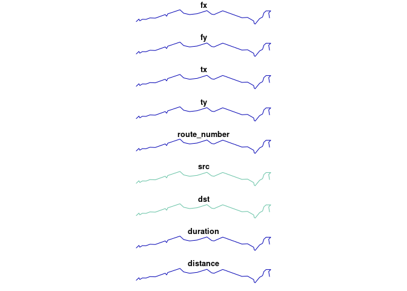

<!-- README.md is generated from README.Rmd. Please edit that file -->

# stplanr <a href='https://docs.ropensci.org/stplanr/'></a>

[](https://travis-ci.org/ropensci/stplanr)
[](https://github.com/metacran/cranlogs.app)
[](https://cran.r-project.org/package=stplanr)
[](https://cran.r-project.org/package=stplanr)
[](https://www.tidyverse.org/lifecycle/#maturing)
[](https://github.com/ropensci/onboarding/issues/10)

**stplanr** is a package for sustainable transport planning with R.

It provides functions for solving common problems in transport planning
and modelling, such as how to best get from point A to point B. The
overall aim is to provide a reproducible, transparent and accessible
toolkit to help people better understand transport systems and inform
policy, as outlined in a
[paper](https://journal.r-project.org/archive/2018/RJ-2018-053/index.html)
about the package, and the potential for open source software in
transport planning in general, published in the [R
Journal](https://journal.r-project.org/).

The initial work on the project was funded by the Department of
Transport
([DfT](https://www.gov.uk/government/organisations/department-for-transport))
as part of the development of the Propensity to Cycle Tool (PCT), a web
application to explore current travel patterns and cycling potential at
zone, desire line, route and route network levels (see
[www.pct.bike](http://www.pct.bike/) and click on a region to try it
out). The basis of the methods underlying the PCT is origin-destination
data, which are used to highlight where many short distance trips are
being made, and estimate how many could switch to cycling. The results
help identify where cycleways are most needed, an important component of
sustainable transport planning infrastructure engineering and policy
[design](https://www.icevirtuallibrary.com/doi/abs/10.1680/dfct.63495.001).

See the package vignette (e.g. via `vignette("introducing-stplanr")`) or
an [academic paper on the Propensity to Cycle Tool
(PCT)](http://dx.doi.org/10.5198/jtlu.2016.862) for more information on
how it can be used. This README provides some basics.

Although much of the work supports research undertaken at the Leeds’
Institute for Transport Studies
([ITS](https://environment.leeds.ac.uk/transport)), **stplanr** should
be useful to researchers everywhere. The function `route_graphhopper()`,
for example, works anywhere in the world using the
[graphhopper](https://graphhopper.com/) routing API and
`read_table_builder()` reads-in Australian data. We welcome
contributions that make transport research easier worldwide.

## Key functions

Data frames representing flows between origins and destinations must be
combined with geo-referenced zones or points to generate meaningful
analyses and visualisations of ‘flows’ or origin-destination (OD) data.
**stplanr** facilitates this with `od2line()`, which takes flow and
geographical data as inputs and outputs spatial data. Some example data
is provided in the package:

``` r
library(stplanr)
```

Let’s take a look at this data:

``` r
od_data_sample[1:3, 1:3] # typical form of flow data
#> # A tibble: 3 x 3
#>   geo_code1 geo_code2   all
#>   <chr>     <chr>     <dbl>
#> 1 E02002361 E02002361   109
#> 2 E02002361 E02002363    38
#> 3 E02002361 E02002367    10
cents_sf[1:3,] # points representing origins and destinations
#>       geo_code  MSOA11NM percent_fem  avslope             geometry
#> 1708 E02002384 Leeds 055    0.458721 2.856563 -1.546463, 53.809517
#> 1712 E02002382 Leeds 053    0.438144 2.284782 -1.511861, 53.811611
#> 1805 E02002393 Leeds 064    0.408759 2.361707 -1.524205, 53.804098
```

These datasets can be combined as follows:

``` r
travel_network <- od2line(flow = od_data_sample, zones = cents_sf)
w <- flow$all / max(flow$all) *10
plot(travel_network, lwd = w)
```


**stplanr** has many functions for working with OD data. See the
[`stplanr-od`](https://docs.ropensci.org/stplanr/articles/stplanr-od.html)
vignette for details.

The package can also allocate flows to the road network, e.g. with
[CycleStreets.net](https://www.cyclestreets.net/api/) and the
OpenStreetMap Routing Machine
([OSRM](https://github.com/Project-OSRM/osrm-backend)) API interfaces.
These are supported in `route_*()` functions such as
`route_cyclestreets` and `route_osrm()`:

Route functions take lat/lon inputs (results not calculated):

``` r
trip <- route_osrm(from = c(-1, 53), to = c(-1.1, 53))
```

and place names, found using the Google Map API:

We can replicate this call multiple times using `line2route`, in this
case lines 2 to 5. First we’ll create a small subset of the lines:

``` r
desire_lines <- travel_network[2:6,]
```

Next, we’ll calculate the routes (not not evaluated):

``` r
routes <- line2route(desire_lines, route_fun = route_osrm)
```

The resulting routes will look something like this:

``` r
lwd <- desire_lines$foot
routes <- routes_fast_sf[2:6, ]
plot(routes$geometry, lwd = lwd)
plot(desire_lines$geometry, col = "green", lwd = lwd, add = TRUE)
```


For more examples, `example("line2route")`.

`overline` is a function which takes a series of route-allocated lines,
splits them into unique segments and aggregates the values of
overlapping lines. This can represent where there will be most traffic
on the transport system, as demonstrated in the following code chunk.

``` r
routes$foot <- desire_lines$foot
rnet <- overline2(routes, attrib = "foot")
#> 2019-11-14 16:08:24 constructing segments
#> 2019-11-14 16:08:24 building geometry
#> 2019-11-14 16:08:24 simplifying geometry
#> 2019-11-14 16:08:24 aggregating flows
#> 2019-11-14 16:08:24 rejoining segments into linestrings
```

The resulting route network, with segment totals calculated from
overlapping parts for the routes for walking, can be visualised as
follows:

``` r
plot(rnet["foot"], lwd = rnet$foot)
```



The above plot represents the number walking trips made (the ‘flow’)
along particular segments of a transport network.

<!-- (results not shown): -->

## Policy applications

The examples shown above, based on tiny demonstration datasets, may not
seem particularly revolutionary. At the city scale, however, this type
of analysis can be used to inform sustainable transport policies, as
described in papers [describing the Propensity to Cycle
Tool](https://www.jtlu.org/index.php/jtlu/article/view/862/859) (PCT),
and its [application to calculate cycling to school
potential](https://www.sciencedirect.com/science/article/pii/S2214140518301257)
across England.

Results generated by **stplanr** are now part of national government
policy: the PCT is the recommended tool for local and regional
authorities developing strategic cycle network under the Cycling and
Walking Infrastructure Strategy
([CWIS](https://www.gov.uk/government/publications/cycling-and-walking-investment-strategy)),
which is part of the Infrastructure Act
[2015](http://www.legislation.gov.uk/ukpga/2015/7/contents/enacted).
**stplanr** is helping dozens of local authorities across the UK to
answer the question: where to prioritise investment in cycling? In
essence, stplanr was designed to support sustainable transport policies.

There are many other research and policy questions that functions in
**stplanr**, and other open source software libraries and packages, can
help answer. At a time of climate, health and social crises, it is
important that technology is not only sustainable itself (e.g. as
enabled by open source communities and licenses) but that it contributes
to a sustainable future.

## Installation

To install the stable version, use:

``` r
install.packages("stplanr")
```

The development version can be installed using **devtools**:

``` r
# install.packages("devtools") # if not already installed
devtools::install_github("ropensci/stplanr")
library(stplanr)
```

stplanr depends on rgdal, which can be tricky to install.

### Installing stplanr on Linux and Mac

**stplanr** depends on **sf**. Installation instructions for Mac, Ubuntu
and other Linux distros can be found here:
<https://github.com/r-spatial/sf#installing>

## Funtions, help and contributing

The current list of available functions can be seen on the package’s
website at
[docs.ropensci.org/stplanr/](https://docs.ropensci.org/stplanr/), or
with the following command:

``` r
lsf.str("package:stplanr", all = TRUE)
```

To get internal help on a specific function, use the standard way.

``` r
?od2line
```

To contribute, report bugs or request features, see the [issue
tracker](https://github.com/ropensci/stplanr/issues).

## Further resources / tutorials

Want to learn how to use open source software for reproducible
sustainable transport planning work? Now is a great time to learn.
Transport planning is a relatively new field of application in R.
However, there are already some good resources on the topic, including
(any further suggestions: welcome):

  - The Transport chapter of *Geocomputation with R*, which provides a
    broad introduction from a geographic data perspective:
    <https://geocompr.robinlovelace.net/transport.html>
  - The **stplanr** paper, which describes the context in which the
    package was developed:
    <https://journal.r-project.org/archive/2018/RJ-2018-053/index.html>
    (please cite this if you use **stplanr** in your work)
  - The `dodgr` vignette, which provides an introduction to routing in
    R: <https://cran.r-project.org/package=dodgr/vignettes/dodgr.html>

## Meta

  - Please report issues, feature requests and questions to the [github
    issue tracker](https://github.com/ropensci/stplanr/issues)
  - License: MIT
  - Get citation information for **stplanr** in R doing
    `citation(package = 'stplanr')`
  - This project is released with a [Contributor Code of
    Conduct](https://github.com/ropensci/stplanr/blob/master/CONDUCT.md).
    By participating in this project you agree to abide by its
terms.

[](http://ropensci.org)
