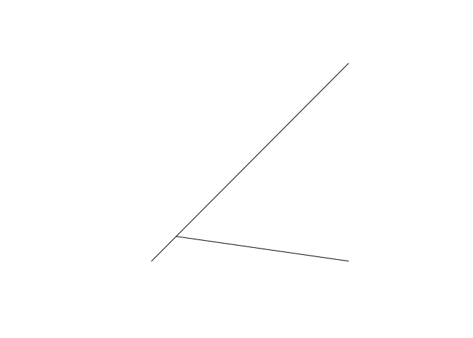

This article was written following new functionality added to the
`{stplanr}` package by Josiah Parry, in [this pull request
(`#540`)`)](https://github.com/ropensci/stplanr/pull/540). As described issue [`\#539\`](https://github.com/ropensci/stplanr/issues/539),
the original implementation was slower than needed.

This short article describes what the function does, benchmarks
alternative implementation, and concludes with some thoughts about the
`{stplanr}` package. It was written straight after the new functionality
was implemented, so we’ll start by installing that version of the
package:

``` r
remotes::install_github(repo = "ropensci/stplanr", ref = "39858b6")
```

    ## Using github PAT from envvar GITHUB_PAT

    ## Skipping install of 'stplanr' from a github remote, the SHA1 (39858b69) has not changed since last install.
    ##   Use `force = TRUE` to force installation

Loading the package allows us to run the function.

``` r
library(stplanr)
```

`mats2line()` is a function that takes 2 sets of coordinates and
converts them into linestrings. A simple example is shown function’s
online
[documentation](https://docs.ropensci.org/stplanr/reference/mats2line.html)
hosted by community science support organsiation rOpenSci:

``` r
m1 <- matrix(c(1, 2, 1, 2), ncol = 2)
m2 <- matrix(c(9, 9, 9, 1), ncol = 2)
l <- mats2line(m1, m2)
class(l)
```

    ## [1] "sfc_LINESTRING" "sfc"

``` r
l
```

    ## Geometry set for 2 features 
    ## Geometry type: LINESTRING
    ## Dimension:     XY
    ## Bounding box:  xmin: 1 ymin: 1 xmax: 9 ymax: 9
    ## CRS:           NA

    ## LINESTRING (1 1, 9 9)

    ## LINESTRING (2 2, 9 1)

``` r
lsf <- sf::st_sf(l, crs = 4326)
class(lsf)
```

    ## [1] "sf"         "data.frame"

``` r
plot(lsf)
```

<!-- -->

The previous version of `mats2line()` as as follows, which shows how it
works (see the new implementation in [source
code](https://github.com/ropensci/stplanr/blob/39858b69ba1f4ea978a46aec3df0086b9304ce24/R/line_via.R#L19-L47)):

``` r
mats2line_old <- function(mat1, mat2, crs = NA) {
  l <- lapply(1:nrow(mat1), function(i) {
    mat_combined <- rbind(mat1[i, ], mat2[i, ])
    sf::st_linestring(mat_combined)
  })
  if(is.na(crs)) {
    sf::st_sfc(l)
  } else {
    sf::st_sfc(l, crs = crs)
  }
}
```

The new function is as follows:

``` r
mats2line
```

    ## function (mat1, mat2, crs = NA) 
    ## {
    ##     if (nrow(mat1) != nrow(mat2)) {
    ##         rlang::abort("`mat1` and `mat2` must have the same number of rows.")
    ##     }
    ##     else if (ncol(mat1) != 2 || ncol(mat2) != 2) {
    ##         rlang::abort("`mat1` and `mat2` must have exactly 2 columns")
    ##     }
    ##     m <- vctrs::vec_interleave(mat1, mat2)
    ##     m <- cbind(m, rep.int(1:nrow(mat1), rep(2, nrow(mat1))))
    ##     colnames(m) <- c("x", "y", "id")
    ##     res <- sfheaders::sfc_linestring(m, x = "x", y = "y", linestring_id = "id")
    ##     sf::st_set_crs(res, crs)
    ## }
    ## <bytecode: 0x55dcd0f245d0>
    ## <environment: namespace:stplanr>

We can check the 2 results are similar as follows:

``` r
l_old <- mats2line_old(m1, m2)
waldo::compare(l_old, l)
```

    ## ✔ No differences

As shown, the 2 results are identical.

Let’s do a quick benchmark:

``` r
bench::mark(
  mats2line_old(m1, m2),
  mats2line(m1, m2)
)
```

    ## # A tibble: 2 × 6
    ##   expression                 min   median `itr/sec` mem_alloc `gc/sec`
    ##   <bch:expr>            <bch:tm> <bch:tm>     <dbl> <bch:byt>    <dbl>
    ## 1 mats2line_old(m1, m2)   43.7µs   47.1µs    20153.  105.54KB     40.0
    ## 2 mats2line(m1, m2)       45.9µs     50µs    18689.    3.01KB     34.9

From that you may think there’s no benefit to speeding things up. But,
when you look at the benchmark results for larger matrices, you can see
the difference (as shown in the initial issue
[`#539`](https://github.com/ropensci/stplanr/issues/539):

``` r
m1 <- matrix(rnorm(20000), ncol = 2)
m2 <- matrix(runif(20000), ncol = 2)
bench::mark(
  mats2line_old(m1, m2),
  mats2line(m1, m2)
)
```

    ## Warning: Some expressions had a GC in every iteration; so filtering is
    ## disabled.

    ## # A tibble: 2 × 6
    ##   expression                 min   median `itr/sec` mem_alloc `gc/sec`
    ##   <bch:expr>            <bch:tm> <bch:tm>     <dbl> <bch:byt>    <dbl>
    ## 1 mats2line_old(m1, m2) 103.56ms  112.4ms      7.71  518.21KB     44.3
    ## 2 mats2line(m1, m2)       6.08ms    7.1ms    114.      4.01MB     31.5

<!-- 
&#10;
```r
remotes::install_cran("rsgeo")
```
&#10;
&#10;```r
packageVersion("rsgeo")
```
&#10;
The new implementation uses the `{rsgeo}` package by default, which can be installed as follows:
&#10;If this is the first time installing the package and you have Rust installed, it may take some time.
This is because the package is compiled from source code, which is a bit slower than installing a pre-compiled binary.
&#10;You can check which version of the package you have installed as follows (`{rsgeo}` version 0.1.6 or later is required):
-->
