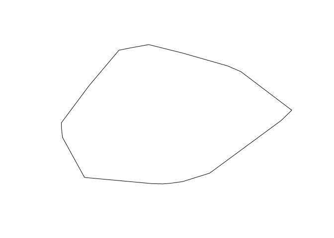
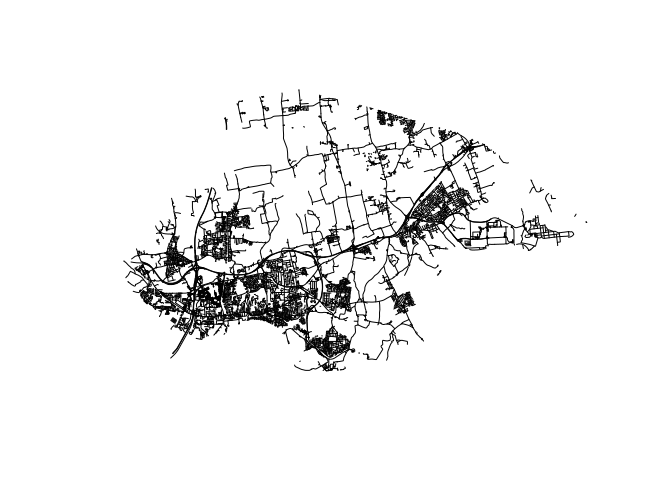
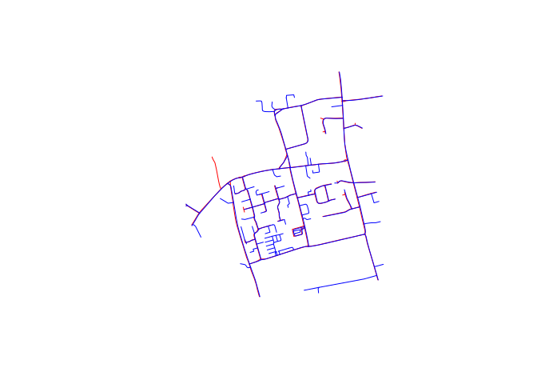
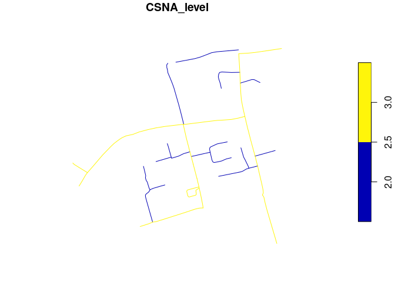
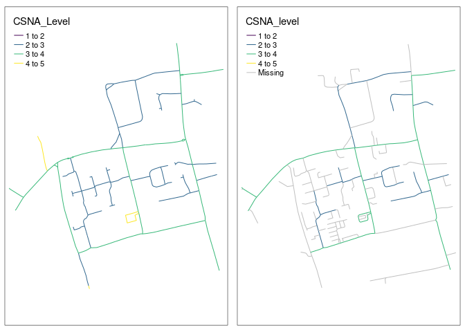
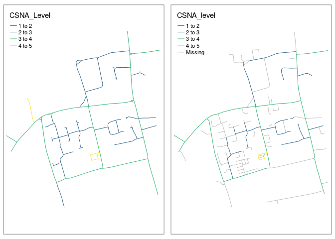
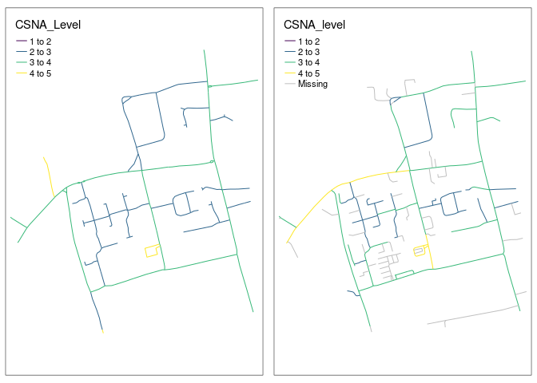
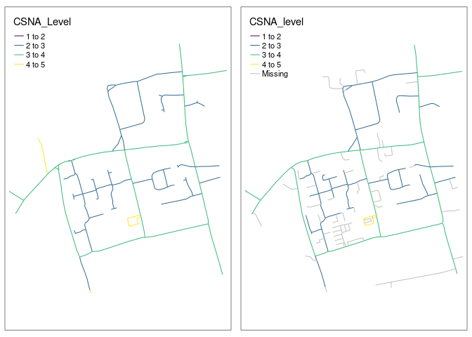

# Test out network merging functionality

``` r
# Get zip in working directory
list.files("~/Downloads/", pattern = "zip")
f = list.files("~/Downloads/", pattern = "OneDrive_1_19-09-2023.zip", full.names = TRUE)
f
# Unzip
unzip(f, exdir = "./data-raw/csna_data")
```

Read-in data:

``` r
library(tidyverse)
```

    ── Attaching core tidyverse packages ──────────────────────── tidyverse 2.0.0 ──
    ✔ dplyr     1.1.3     ✔ readr     2.1.4
    ✔ forcats   1.0.0     ✔ stringr   1.5.0
    ✔ ggplot2   3.4.3     ✔ tibble    3.2.1
    ✔ lubridate 1.9.2     ✔ tidyr     1.3.0
    ✔ purrr     1.0.2     
    ── Conflicts ────────────────────────────────────────── tidyverse_conflicts() ──
    ✖ dplyr::filter() masks stats::filter()
    ✖ dplyr::lag()    masks stats::lag()
    ℹ Use the conflicted package (<http://conflicted.r-lib.org/>) to force all conflicts to become errors

``` r
list.files("./data-raw/csna_data/", pattern = "shp")
```

    character(0)

``` r
csna_data = sf::read_sf("csna_data/Thurrock Roads_polyline.shp")
csna_data = sf::st_transform(csna_data, "EPSG:4326")

# Get OSM data for area
csna_convex_hull = sf::st_convex_hull(sf::st_union(csna_data))
csna_centroid = sf::st_centroid(csna_convex_hull)
plot(csna_convex_hull)
```



``` r
osm_data = osmextract::oe_get_network(csna_centroid, "driving", extra_tags = c("highway", "name", "maxspeed"), boundary = csna_convex_hull, boundary_type = "clipsrc")
```

    The input place was matched with Essex. 
    The chosen file was already detected in the download directory. Skip downloading.
    Starting with the vectortranslate operations on the input file!

    0...10...20...30...40...50...60...70...80...90...100 - done.

    Warning in CPL_gdalvectortranslate(source, destination, options, oo, doo, :
    GDAL Message 1: A geometry of type MULTILINESTRING is inserted into layer lines
    of geometry type LINESTRING, which is not normally allowed by the GeoPackage
    specification, but the driver will however do it. To create a conformant
    GeoPackage, if using ogr2ogr, the -nlt option can be used to override the layer
    geometry type. This warning will no longer be emitted for this combination of
    layer and feature geometry type.

    Finished the vectortranslate operations on the input file!

    Reading layer `lines' from data source 
      `/home/robin/data/osm/geofabrik_essex-latest.gpkg' using driver `GPKG'
    Simple feature collection with 8993 features and 12 fields
    Geometry type: MULTILINESTRING
    Dimension:     XY
    Bounding box:  xmin: 0.216299 ymin: 51.45155 xmax: 0.5495789 ymax: 51.57737
    Geodetic CRS:  WGS 84

``` r
plot(osm_data$geometry)
```



``` r
# Length of networks
sum(sf::st_length(csna_data)) |>
  units::set_units("km")
```

    927.9664 [km]

``` r
sum(sf::st_length(osm_data)) |>
  units::set_units("km")
```

    1180.52 [km]

We’ll take a subset in a 500 m buffer in the centre of the study area.

``` r
buffer = sf::st_buffer(csna_centroid, 500)
osm_subset = sf::st_intersection(osm_data, buffer)
```

    Warning: attribute variables are assumed to be spatially constant throughout
    all geometries

``` r
csna_subset = sf::st_intersection(csna_data, buffer)
```

    Warning: attribute variables are assumed to be spatially constant throughout
    all geometries

Let’s plot the two networks:

``` r
plot(csna_subset$geometry, col = "red")
plot(osm_subset$geometry, col = "blue", add = TRUE)
```



``` r
summary(csna_subset$CSNA_Level)
```

       Min. 1st Qu.  Median    Mean 3rd Qu.    Max. 
      2.000   2.000   2.000   2.517   3.000   6.000 

``` r
funs = list(CSNA_level = max)
osm_joined = stplanr::rnet_merge(osm_subset, csna_subset, funs = funs)
```

    Warning: attribute variables are assumed to be spatially constant throughout
    all geometries

    Warning in st_cast.sf(sf::st_cast(x, "MULTILINESTRING"), "LINESTRING"):
    repeating attributes for all sub-geometries for which they may not be constant

    Joining with `by = join_by(osm_id)`
    Joining with `by = join_by(osm_id)`

``` r
waldo::compare(osm_joined$geometry, csna_subset$geometry)
```

    `old` is length 107
    `new` is length 118

    `attr(old, 'bbox')`: "((0.3597854,51.50738),(0.3718281,51.51591))"
    `attr(new, 'bbox')`: "((0.3597861,51.50738),(0.3717286,51.51591))"

    `attr(old, 'crs')$input`: "WGS 84"   
    `attr(new, 'crs')$input`: "EPSG:4326"

    `dim(old[[1]])`: 6 2
    `dim(new[[1]])`: 4 2

    `old[[1]]`: "LINESTRING (0.3672797 51.50..."
    `new[[1]]`: "LINESTRING (0.3682288 51.51..."

    `dim(old[[2]])`: 23 2
    `dim(new[[2]])`:  2 2

    `old[[2]]`: "LINESTRING (0.360145 51.510..."
    `new[[2]]`: "LINESTRING (0.3633168 51.51..."

    `old[[3]]`: "LINESTRING (0.370691 51.509..."
    `new[[3]]`: "LINESTRING (0.3654734 51.51..."

    `dim(old[[4]])`:  9 2
    `dim(new[[4]])`: 12 2

    `old[[4]]`: "LINESTRING (0.3661647 51.51..."
    `new[[4]]`: "LINESTRING (0.361379 51.512..."

    And 209 more differences ...

``` r
summary(osm_joined$geometry %in% osm_subset$geometry)
```

       Mode    TRUE 
    logical     107 

``` r
osm_joined
```

    Simple feature collection with 107 features and 14 fields
    Geometry type: LINESTRING
    Dimension:     XY
    Bounding box:  xmin: 0.3597854 ymin: 51.50738 xmax: 0.3718281 ymax: 51.51591
    Geodetic CRS:  WGS 84
    First 10 features:
        osm_id        name      highway waterway aerialway barrier man_made access
    1  4384852 Rowley Road  residential     <NA>      <NA>    <NA>     <NA>   <NA>
    2  4384853   High Road    secondary     <NA>      <NA>    <NA>     <NA>   <NA>
    3  4384855 School Lane  residential     <NA>      <NA>    <NA>     <NA>   <NA>
    4  4384857  Pound Lane  residential     <NA>      <NA>    <NA>     <NA>   <NA>
    5  4568525    Fen Lane unclassified     <NA>      <NA>    <NA>     <NA>   <NA>
    6  4568593   Mill Lane unclassified     <NA>      <NA>    <NA>     <NA>   <NA>
    7  4568594   Mill Lane unclassified     <NA>      <NA>    <NA>     <NA>   <NA>
    8  4568595   Mill Lane      service     <NA>      <NA>    <NA>     <NA>   <NA>
    9  4568596   The Green  residential     <NA>      <NA>    <NA>     <NA>   <NA>
    10 4568597        <NA>      service     <NA>      <NA>    <NA>     <NA>   <NA>
       service maxspeed z_order
    1     <NA>     <NA>       3
    2     <NA>     <NA>       6
    3     <NA>     <NA>       3
    4     <NA>     <NA>       3
    5     <NA>     <NA>       3
    6     <NA>     <NA>       3
    7     <NA>     <NA>       3
    8     <NA>     <NA>       0
    9     <NA>     <NA>       3
    10    <NA>     <NA>       0
                                                                   other_tags
    1                                                                    <NA>
    2                                                           "ref"=>"B188"
    3                                 "sidewalk"=>"both","surface"=>"asphalt"
    4                                                                    <NA>
    5                                                                    <NA>
    6                                                         "oneway"=>"yes"
    7                                                                    <NA>
    8  "designation"=>"public_bridleway","horse"=>"yes","motorcar"=>"private"
    9                                                                    <NA>
    10                                                                   <NA>
       CSNA_level                       geometry  length_x
    1           3 LINESTRING (0.3672797 51.50... 119.95760
    2           3 LINESTRING (0.360145 51.510... 509.84284
    3          NA LINESTRING (0.370691 51.509... 241.89090
    4           2 LINESTRING (0.3661647 51.51... 229.95311
    5           3 LINESTRING (0.3606277 51.51...  69.71302
    6          NA LINESTRING (0.3623346 51.51... 355.78291
    7          NA LINESTRING (0.3636589 51.50... 125.19843
    8          NA LINESTRING (0.3642193 51.50...  19.90700
    9           2 LINESTRING (0.3665946 51.51... 194.09989
    10         NA LINESTRING (0.368502 51.511...  67.64835

Let’s plot the result:osm_subset

``` r
osm_joined |>
  select(CSNA_level) |>
  plot()
```



Plot with tmap

``` r
library(tmap)
```

    The legacy packages maptools, rgdal, and rgeos, underpinning the sp package,
    which was just loaded, will retire in October 2023.
    Please refer to R-spatial evolution reports for details, especially
    https://r-spatial.org/r/2023/05/15/evolution4.html.
    It may be desirable to make the sf package available;
    package maintainers should consider adding sf to Suggests:.
    The sp package is now running under evolution status 2
         (status 2 uses the sf package in place of rgdal)

    Breaking News: tmap 3.x is retiring. Please test v4, e.g. with
    remotes::install_github('r-tmap/tmap')

``` r
brks = 1:5
m1 = tm_shape(osm_joined) +
  tm_lines(col = "CSNA_level", palette = "viridis", breaks = brks)
m2 = tm_shape(csna_subset) +
  tm_lines(col = "CSNA_Level", palette = "viridis", breaks = brks)
tmap_arrange(m2, m1)
```

    Warning: Values have found that are higher than the highest break

    Warning: Values have found that are higher than the highest break



We can try to improve the fit by changing the arguments that feed into
the `rnet_merge` function.

``` r
osm_joined2 = stplanr::rnet_merge(osm_subset, csna_subset, funs = funs, dist = 15)
```

    Warning: attribute variables are assumed to be spatially constant throughout
    all geometries

    Warning in st_cast.sf(sf::st_cast(x, "MULTILINESTRING"), "LINESTRING"):
    repeating attributes for all sub-geometries for which they may not be constant

    Joining with `by = join_by(osm_id)`
    Joining with `by = join_by(osm_id)`

``` r
m1 = tm_shape(osm_joined2) +
  tm_lines(col = "CSNA_level", palette = "viridis", breaks = brks)
m2 = tm_shape(csna_subset) +
  tm_lines(col = "CSNA_Level", palette = "viridis", breaks = brks)
tmap_arrange(m2, m1)
```

    Warning: Values have found that are higher than the highest break

    Warning: Values have found that are higher than the highest break

    Warning: Values have found that are higher than the highest break

    Warning: Values have found that are higher than the highest break



We’ll set a max segment length.

``` r
args(stplanr::rnet_join)
```

    function (rnet_x, rnet_y, dist = 5, length_y = TRUE, key_column = 1, 
        subset_x = TRUE, dist_subset = NULL, segment_length = 0, 
        endCapStyle = "FLAT", contains = TRUE, max_angle_diff = NULL, 
        ...) 
    NULL

``` r
osm_joined3 = stplanr::rnet_merge(osm_subset, csna_subset, funs = funs, dist = 15, segment_length = 10)
```

    Warning: attribute variables are assumed to be spatially constant throughout
    all geometries

    Warning in st_cast.sf(sf::st_cast(x, "MULTILINESTRING"), "LINESTRING"):
    repeating attributes for all sub-geometries for which they may not be constant

    Joining with `by = join_by(osm_id)`
    Linking to GEOS 3.11.1, GDAL 3.6.4, PROJ 9.1.1; sf_use_s2() is TRUE
    Joining with `by = join_by(osm_id)`

``` r
m1 = tm_shape(osm_joined3) +
  tm_lines(col = "CSNA_level", palette = "viridis", breaks = brks)
m2 = tm_shape(csna_subset) +
  tm_lines(col = "CSNA_Level", palette = "viridis", breaks = brks)
tmap_arrange(m2, m1)
```

    Warning: Values have found that are higher than the highest break

    Warning: Values have found that are higher than the highest break

    Warning: Values have found that are higher than the highest break

    Warning: Values have found that are higher than the highest break



Finally we’ll set a max angle difference.

``` r
osm_joined4 = stplanr::rnet_merge(osm_subset, csna_subset, funs = funs, dist = 7, segment_length = 10, max_angle_diff = 30)
```

    Warning: attribute variables are assumed to be spatially constant throughout
    all geometries

    Warning in st_cast.sf(sf::st_cast(x, "MULTILINESTRING"), "LINESTRING"):
    repeating attributes for all sub-geometries for which they may not be constant

    Joining with `by = join_by(osm_id)`

    Warning: st_centroid assumes attributes are constant over geometries

    Joining with `by = join_by(osm_id)`

``` r
m1 = tm_shape(osm_joined4) +
  tm_lines(col = "CSNA_level", palette = "viridis", breaks = brks)
m2 = tm_shape(csna_subset) +
  tm_lines(col = "CSNA_Level", palette = "viridis", breaks = brks)
tmap_arrange(m2, m1)
```

    Warning: Values have found that are higher than the highest break

    Warning: Values have found that are higher than the highest break

    Warning: Values have found that are higher than the highest break

    Warning: Values have found that are higher than the highest break



Save the output as follows.

``` r
sf::st_write(osm_joined4, "osm_joined4.geojson")
```

    Writing layer `osm_joined4' to data source 
      `osm_joined4.geojson' using driver `GeoJSON'
    Writing 107 features with 14 fields and geometry type Line String.
