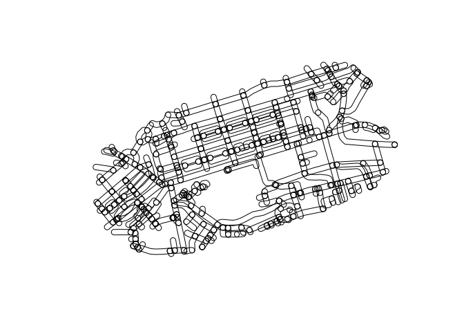
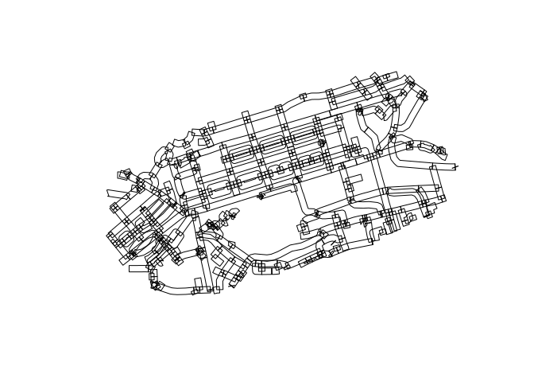
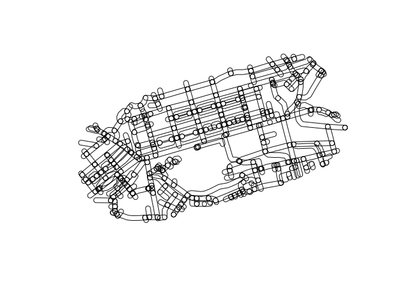
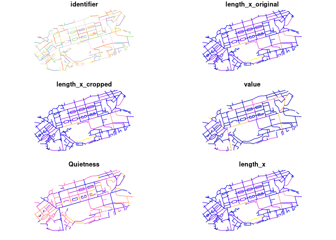

Testing geo_buffer
================

``` r
# devtools::load_all()
sf::sf_use_s2(FALSE)
```

    ## Spherical geometry (s2) switched off

``` r
remotes::install_dev("stplanr")
```

    ## Using github PAT from envvar GITHUB_PAT

    ## Skipping install of 'stplanr' from a github remote, the SHA1 (b88dbc83) has not changed since last install.
    ##   Use `force = TRUE` to force installation

``` r
packageVersion("stplanr")
```

    ## [1] '1.1.2.9000'

``` r
library(stplanr)
library(dplyr)
```

    ## 
    ## Attaching package: 'dplyr'

    ## The following objects are masked from 'package:stats':
    ## 
    ##     filter, lag

    ## The following objects are masked from 'package:base':
    ## 
    ##     intersect, setdiff, setequal, union

``` r
library(tmap)
```

    ## The legacy packages maptools, rgdal, and rgeos, underpinning the sp package,
    ## which was just loaded, will retire in October 2023.
    ## Please refer to R-spatial evolution reports for details, especially
    ## https://r-spatial.org/r/2023/05/15/evolution4.html.
    ## It may be desirable to make the sf package available;
    ## package maintainers should consider adding sf to Suggests:.
    ## The sp package is now running under evolution status 2
    ##      (status 2 uses the sf package in place of rgdal)

    ## 
    ## Attaching package: 'tmap'

    ## The following object is masked from 'package:datasets':
    ## 
    ##     rivers

``` r
library(ggplot2)
library(tmaptools)
rnet_x = sf::read_sf("https://github.com/ropensci/stplanr/releases/download/v1.0.2/rnet_x_ed.geojson")
rnet_y = sf::read_sf("https://github.com/ropensci/stplanr/releases/download/v1.0.2/rnet_y_ed.geojson")
rnet_x_buffer = geo_buffer(rnet_x, dist = 20)
plot(rnet_x_buffer$geometry)
```

<!-- -->

``` r
plot(geo_buffer(rnet_x, dist = 20, endCapStyle = "FLAT")$geometry)
```

<!-- -->

With projected data:

``` r
rnet_xp = sf::st_transform(rnet_x, "EPSG:27700")
rnet_yp = sf::st_transform(rnet_y, "EPSG:27700")
rnet_xp_buffer = geo_buffer(rnet_xp, dist = 20)
plot(rnet_xp_buffer$geometry)
```

<!-- -->

# Try merging projected data

``` r
funs = list(value = sum, Quietness = mean)
rnet_merged = rnet_merge(rnet_xp, rnet_yp, dist = 10, segment_length = 20, funs = funs)
```

    ## Warning: attribute variables are assumed to be spatially constant throughout
    ## all geometries

    ## Warning in st_cast.sf(sf::st_cast(x, "MULTILINESTRING"), "LINESTRING"):
    ## repeating attributes for all sub-geometries for which they may not be constant

    ## Joining with `by = join_by(identifier)`
    ## Joining with `by = join_by(identifier)`

``` r
plot(rnet_merged)
```

<!-- -->
